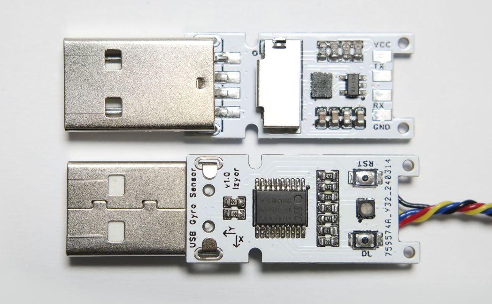

# USB Gyro Firmware and Host Demo Code

This is a USB accelerometer sensor specifically designed for desktop computers, with firmware code and example host code. This code is an additional part of an article published on a Chinese website, hence it is in Chinese.

为台式机设计的USB即插即用加速度陀螺仪传感器，固件代码和上位机样例代码。



硬件开源oshwhub：<https://oshwhub.com/lzyor/oshwhub-usb-acc-1>

软件开源github：<https://github.com/lzyor/oshw-usb-gyro>

## 包含

- hardware：立创eda导出和原理图和gerber文件
- firmware-gyro-hid：固件代码实现hid
- py-air-mouse：python读取数据和模拟鼠标
- rs-bevy-3d-view：rust实现简单滤波和3D界面演示

## 硬件设计 hardware

简单便宜的基于stc8h8k64u单片机，有硬件全速 `usb2.0 12MHz` ，加速度陀螺仪使用lsm6ds3tr传感器。

额外增加了sd卡槽，rgb指示灯，两个按键，串口输出。可做usb转串口，或usb读卡器（非常慢）。

硬件文件夹包含立创eda专业版导出的工程文件，SVG导出原理图，PCB导出的Gerber文件。

## 固件代码 firmware-gyro-hid

简单实现 `usb-hid` 免驱设备，请自行修改描述符文件。

基于sdcc4.4编译器，移植到keil请注意语法和字节序问题。

包含usb-hid代码和lsm6ds3tr驱动。外设和引脚配置请参考 `bsp.c` 和 `bsp.h` 文件。

```bash
# 清理
make clean
# 编译
make
# 输出位于 bin/main.ihx
```

默认工作在 `24MHz`，复位脚用作复位。固件代码检测 `DL` 按钮，按下时自动复位到 `usb-isp` 下载模式。两个按键可以配置成普通通用用途。

## 模拟鼠标 py-air-mouse

样例代码，无滤波，python访问设备并读取传感器值，并模拟鼠标操作实现“空中鼠标”功能。显然，也可以修改固件实现硬件鼠标，这里的代码是软件模拟鼠标。

基于 `hid` 包，模拟鼠标基于 `pyautogui` 包。

```bash
# pip install hid
# pip install pyautogui
./main.py
```

## 演示3D模型 rs-bevy-3d-view

样例代码，用rust读取传感器值并简单滤波，bevy 3D引擎把设备的旋转角度用3D模型还原出来。

角度映射和滤波非常简陋，实际应用需要修改。

素材文件夹里保存了PCB的3D模型。

```bash
# rust最低版本1.75
cargo run
```

## 关于

这是为了愚人节赶工做的，有什么问题，可以联系我orz

bilibili@LzyorStudio (uid 179366563)

lzyor@github.com
